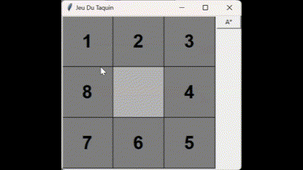

# 15 Puzzle Solver with A* Algorithm
Welcome to the 15 Puzzle Solver repository! This project implements the A* algorithm to solve the classic 15 Puzzle game, also known as the "Game of Fifteen". The goal of the game is to arrange the tiles in numerical order, starting from the top-left corner and ending with the empty space in the center of the grid.  

## Usage
1. Run the 15_puzzle_solver.py script to launch the graphical interface.  
2. Click on the tiles adjacent to the empty space to move them.  
3. Click the "A*" button to automatically solve the puzzle using the A* algorithm.



## Requirements
- Python 3.x
- Tkinter (typically included in Python installations)

## Installation
1. Clone this repository to your local machine.  
2. Ensure you have Python installed.  
3. Navigate to the project directory.  
4. Run the following command to install any required dependencies:  
   ```
   pip install numpy
   ```

## Example
Here is an example of how to solve the 15 Puzzle using the A* algorithm:  
```
python A-Star.py
```


## TODO
- [ ] Add shuffle button.
- [ ] Add 4\*4 grid solver
